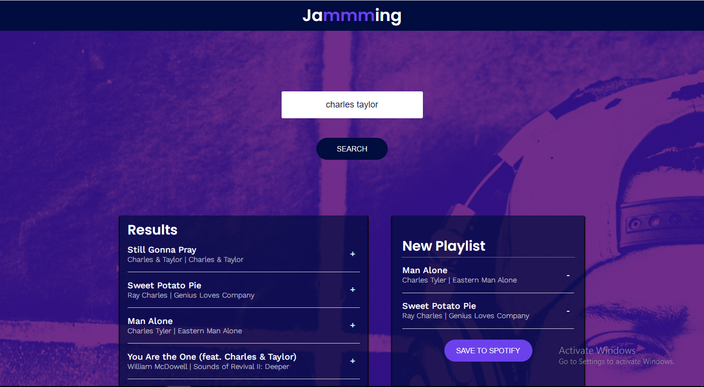
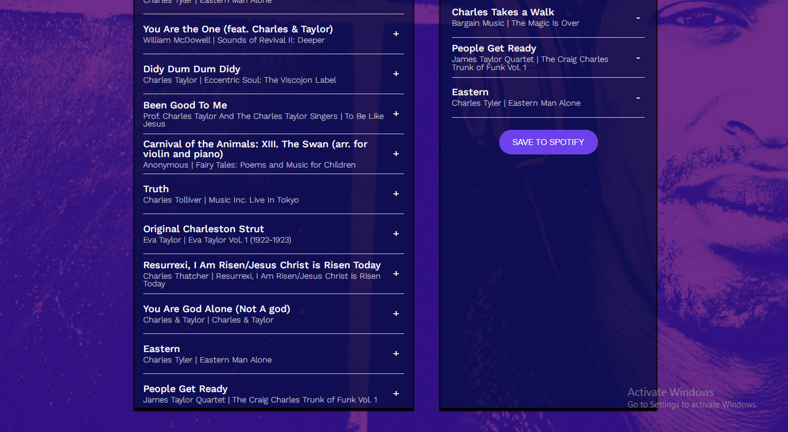

# Jammming

Jammming is a playlist app that allows users to search the Spotify library using the spotify API, create a custom playlist, then save it to their Spotify account.

## Getting Started

In the project directory, you can run:

### `npm start`

Runs the app in the development mode.\
Open [http://localhost:3000](http://localhost:3000) to view it in your browser.

The page will reload when you make changes.\
You may also see any lint errors in the console.

### `npm run build`

Builds the app for production to the `build` folder.\
It correctly bundles React in production mode and optimizes the build for the best performance.

The build is minified and the filenames include the hashes.\
Your app is ready to be deployed!

See the section about [deployment](https://facebook.github.io/create-react-app/docs/deployment) for more information.

## Live Demo

[Live Demo Link](https://jammingplaylist.netlify.app)

## Built With

- REACT
- SPOTIFY API

## Authors

👤 Taiwo Adetunji

- [GitHub](https://github.com/Devtiwo)
- [Twitter](https://twitter.com/devtiwo)
- [LinkedIn](https://www.linkedin.com/in/taiwo-adetunji-860666225/)

## 🤝 Contributing

Contributions, issues, and feature requests are welcome!

## Show your support

Give a ⭐️ if you like this project!
